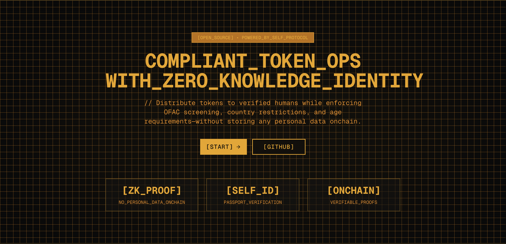

## What is HumanPay in one line

Onchain compliance infrastructure for token operations—combining zero-knowledge identity verification with gas-optimized smart contracts to enable OFAC screening, jurisdiction controls, and sybil resistance without collecting personal data.

## Why this matters

Decentralized protocols need compliance, but existing solutions force an impossible trade-off. Token distributions get exploited by bots. Airdrops lose millions to sybil attackers. Geographic restrictions can't be enforced onchain. Meanwhile, centralized platforms like centralized exchanges offer compliance but require full KYC, custody your funds, and collect invasive personal data. Not to mention the cost associated with integrating a standard KYC process (up to $5/user).

You can't run a compliant token distribution today without either (1) using a centralized platform that collects KYC data, or (2) accepting regulatory risk by ignoring compliance entirely.

We needed infrastructure that could enforce compliance rules directly in smart contracts, using cryptographic proofs instead of trusting third parties.

## Why identity (and why Self)

The breakthrough came when we realized identity verification doesn't require data collection and that it can be verified onchain, enabling smart contract enforcement of these requirements.

By leveraging Self.xyz we can enable cryptographic proof of compliance onchain using government-issued documents, without the personal information ever leaving the user's device. The app cryptographically verifies the government's digital signature on the passport (proving the document is authentic), generates a zero-knowledge proof of specific attributes (like "over 18" and "not from a sanctioned country"), and submits only the proof on-chain. The smart contract gets a cryptographic **yes** or **no**

**Proofs used:** OFAC sanctions screening, age verification (18+), country/nationality verification, document authenticity (government signature validation).

**Verifier learns:** Binary yes/no—the smart contract only knows "this address passed verification" with a 30-day expiry timestamp. Zero personal data touches the blockchain.

**Flow:** User scans QR code → Self.xyz app reads passport NFC chip → App validates government signature → Generates ZK proof of compliance → Submits proof to Self.xyz Hub on Celo → Verification stored with 30-day expiry → User can execute compliant transactions

## How it works (architecture deep-dive)

HumanPay has two operating modes, both built on the same verification infrastructure:

### 1. Distribute Mode (Sender Verification)

For batch token distributions where the sender must prove they're a verified human and pass compliance checks (e.g., DAO distributing contributor rewards, protocol distributing grants).

**Flow:**

1. Sender verifies identity once via Self.xyz (valid 30 days)
2. Upload CSV file (or copy/paste values): `address,amount` for all recipients
3. Execute single on-chain transaction → all recipients paid simultaneously at a very low cost
4. Recipients receive funds directly to their wallets (no claiming step, no coordination needed)

**Technical implementation:**

- `SelfVerifiedMultiSend.sol` checks sender verification via `IVerificationRegistry`
- Assembly-optimized loops minimize gas costs (Allowing up to a thousand recipients at a linear cost per user ~$0.01)
- Works with both native tokens and ERC20 tokens
- Non-custodial: sender approves tokens, contract immediately distributes them

**Use case:** A DAO treasury wants to distribute 10,000 USDC to 1000 contributors. Instead of 1000 individual transactions (1000 × transaction fees + manual coordination), execute one transaction. Total cost: ~$10 in gas.

### 2. Airdrop Mode (Recipient Verification)

For token distributions where each recipient must prove compliance before claiming—critical for regulated token launches, sybil-resistant airdrops, and jurisdiction-restricted distributions.

**Flow:**

1. Creator uploads the data to the platform
2. App generates merkle tree with eligible addresses and amounts
3. Creator deposits tokens to `SelfVerifiedAirdrop.sol` with merkle root
4. Recipients verify identity via Self.xyz (must pass OFAC, jurisdiction, age checks)
5. Each recipient claims their allocation using merkle proof
6. Smart contract enforces: one claim per person (passport-backed), compliance requirements met, valid merkle proof

**Technical implementation:**

- Creator must be verified to create airdrop (proves they control compliant distribution)
- Claimers must be verified to claim (proves they meet jurisdiction/age requirements)
- Merkle proofs prevent double-claiming and validate allocations
- On-chain audit trail: every verification is cryptographically recorded

**Use case:** A protocol launches a governance token but must exclude US persons and OFAC-sanctioned countries. Instead of trusting a centralized platform to enforce geographic restrictions (and collect full KYC data), the smart contract enforces compliance via ZK proofs. One passport = one claim. No bots. No multi-accounting. No personal data stored. Cryptographic proof of compliance for auditors.

### 3. Cross-Chain Verification (Multi-Chain Mode)

Self.xyz verification happens on Celo (where the Hub V2 contract lives), but DeFi protocols and token distributions happen across all chains—Base, Arbitrum, Optimism, etc.

**Architecture:**

- **Celo (source chain)**: `CeloVerificationRegistry` receives Self.xyz proofs, stores 30-day expiry, relays to other chains
- **Other chains** (Base, Arbitrum, etc.): `CrossChainVerificationRegistry` receives verification via Hyperlane, mirrors expiry timestamps
- **Business logic contracts** (`SelfVerifiedMultiSend`, `SelfVerifiedAirdrop`): Identical across all chains, check local registry

**Relay flow:**

1. User verifies on Celo (Self.xyz proof submitted to `CeloVerificationRegistry`)
2. Anyone can relay verification to Base (relayer pays Hyperlane fees)
3. Hyperlane delivers message in 1-5 minutes
4. `CrossChainVerificationRegistry` on Base receives (account address, expiry timestamp)
5. User's verification now valid on both Celo and Base for 30 days
6. Trusted sender mechanism ensures only authorized Celo registries can update Base registry

**Why this matters:** Verify once on Celo, operate compliantly on any supported chain. A protocol on Base can enforce OFAC screening without building its own identity layer or trusting a centralized service. Verification expiry stays synchronized (same 30-day timestamp preserved cross-chain). An alternative solution would be to host a smart contract that holds ETH/Celo in order to pay for the hyperlane message so that it can be included in the verification system, without requiring a separate transaction.

## What shipped

✅ **Smart contracts (Solidity 0.8.28):**

- `CeloVerificationRegistry.sol` - Source registry on Celo with Self.xyz integration
- `CrossChainVerificationRegistry.sol` - Destination registries for Base, Arbitrum, etc.
- `SelfVerifiedMultiSend.sol` - Gas-optimized batch distributions (ETH + ERC20)
- `SelfVerifiedAirdrop.sol` - Merkle-based compliant airdrops
- 85+ passing tests covering verification, distribution, cross-chain relay, edge cases

✅ **Frontend (Next.js 15 + React 19):**

- 4-step wizard: Upload recipients → Verify identity → Configure (chain, token) → Review & execute
- CSV upload with validation (drag-drop or paste)
- Self.xyz QR code integration for passport verification
- Multi-chain support (Celo Sepolia, Base Sepolia)
- Cross-chain relay UI (automatically prompts when distributing on non-Celo chains)

✅ **Multi-chain deployment scripts:**

- Automated deployment to Celo + Base
- Config management (verification scope, config ID, Hyperlane mailboxes)
- Relay verification helper scripts
- Verification status checker

✅ **Production config:**

- Verification config ID: `0x32332b93...` (Age 18+, OFAC Basic screening, no country restrictions)
- Scope seed: `humanpay-multichain` (consistent across all chains)
- Deployed on Celo Sepolia (testnet)
- Base Sepolia integration (testnet)

**Repo:** [github.com/0xleal/verifiable-multisend](https://github.com/0xleal/verifiable-multisend)
**Live demo:** [self-verifiable-multisend.vercel.app](https://self-verifiable-multisend.vercel.app/) (testnet)

## What's next

- [ ] Mainnet deployment (Celo mainnet + Base mainnet)
- [ ] ERC20 token selector in frontend (currently requires manual address input)

## Technical highlights worth mentioning

**Gas optimization:**
The `SelfVerifiedMultiSend.sol` contract uses assembly-level optimization for batch operations. Instead of a standard Solidity loop, we manually manage memory and use inline assembly to minimize storage reads and gas costs. Distributing to 100 addresses costs ~$1 in gas vs. ~$10-15 for individual transactions and handles higher number of recipients.

**Security considerations:**

- 30-day verification expiry ensures ongoing compliance (not one-time-forever)
- Merkle proofs in airdrop mode prevent over-distribution attacks
- Non-custodial throughout: sender approves tokens, contract immediately distributes
- Cross-chain trusted sender enforcement (only whitelisted Celo registries can relay)
- Comprehensive test coverage (85+ tests including edge cases and cross-chain scenarios)

## Lessons learned

**What worked well:**

- Zero-knowledge identity solved the compliance trilemma (compliant + decentralized + private)
- Assembly optimization made batch distributions economically viable
- Cross-chain registry pattern (single source of truth on Celo, relay to others) simplified multi-chain support
- Self.xyz's mobile app UX is excellent—scanning a passport feels like magic

**What was harder than expected:**

- Hyperlane message delivery is non-deterministic (1-5 minutes). We had to build retry logic and clear status indicators in the UI.
- 30-day expiry adds UX friction (users must re-verify monthly), but it's necessary for ongoing compliance.
- Testing cross-chain flows requires running Hyperlane relayers locally or using testnets (slower iteration)

**What surprised us:**

- How many DeFi protocols and DAOs need compliance but don't realize ZK identity infrastructure exists
- Gas costs on Celo are so low that individual transfers are almost viable—but batch is still 50x+ cheaper
- Self.xyz's government signature validation is incredibly robust (works with passports from 100+ countries)
- The demand for "compliant by default" smart contract primitives—teams want to plug in compliance without building it from scratch

## Get involved

- **Try it:** [self-verifiable-multisend.vercel.app](https://self-verifiable-multisend.vercel.app/) (testnet)
- **Repo:** [github.com/0xleal/verifiable-multisend](https://github.com/0xleal/verifiable-multisend)
- **Issues/Help wanted:** Smart contract audit/check
- **Contact:** [@0x_leal](https://x.com/0x_leal) on X
