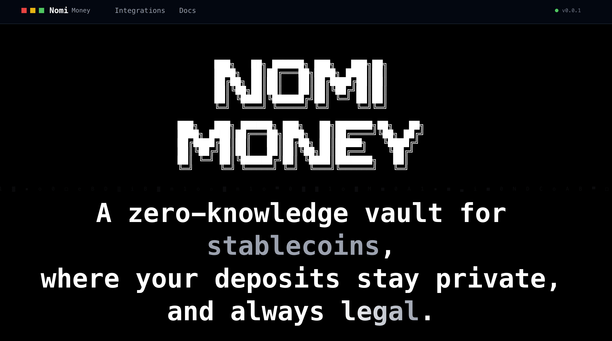

## Nomi Money

**Nomi Money** brings compliant privacy to digital cash.

It's a vault for stablecoins where deposits stay private **and always legal**.

We built it during the Self Residency to prove a simple idea: **privacy and compliance don't have to be enemies**. With Self we can verify *who is allowed to use the pool* (for example, that they're not on sanctions lists, that they're not from a blocked country) **without** knowing their identity, and then let them move their funds into a private pool where their transfers are anonymous.

## Why this matters

Sending or receiving money on blockchain today is completely public: anyone can see how much you send, to whom, and from where. This means legitimate transactions — like payroll, remittances, or payments to suppliers — expose sensitive information.

Additionally, existing privacy solutions were blocked for not complying with regulations.

Nomi Money resolves this tension: it allows making private payments with stablecoins without violating compliance rules (OFAC, country, age). In other words, it enables legal financial privacy — something that didn't exist until now.

**Three types of users benefit:**

- **Individuals** who send money to family members or want to protect their privacy when using stablecoins.
- **Companies and DAOs** that pay salaries or suppliers and need to comply with policies without exposing amounts or employee lists.
- **NGOs and foundations** that make humanitarian transfers to sensitive areas, where publishing addresses or amounts could put beneficiaries at risk.

**A concrete example:**

Imagine a company that pays freelancers in Latin America with stablecoins (cUSD). If it sends payments directly from its wallet today, anyone could see how much each employee or supplier earns.

With Nomi Money, the company deposits funds into the vault by validating that it's a verified user, and then pays privately within the pool. Freelancers receive their money without anyone being able to track how much or from which account, but the system maintains verifiable regulatory compliance.

## Why identity (and why Self)

Until now, if you wanted to comply with regulatory requirements, you had to ask for personal documents and store users' sensitive data. This doesn't scale well and is a security risk.

With Self, we can do the same without seeing or storing personal data: the user proves they're over 18 and not from a sanctioned country without revealing their name, passport, or date of birth. Before, there was no way to do this in Web3 in a private and verifiable way.

**How it works in practice:**

The user verifies once by scanning a QR code from the Self app. After completing verification, Self generates a proof that is sent to the smart contract. After that, they can deposit stablecoins and use them privately for a set period (for example, 30 days) without revealing their identity again.

The contract only learns "✅ the user meets the requirements", never who they are.

**Proofs used:** age 18+, citizenship, OFAC exclusion  
**Verifier learns:** yes/no only — never personal data  
**Flow:** scan QR, verify identity once, use the private pool

## How it works (short flow)

1. **Private verification:** the user scans a QR code and Self generates an identity proof on their device (country, age, OFAC).

2. **Deposit:** the user deposits cUSD into the Nomi Vault, attaching their proof. The contract doesn't receive personal data, only a binary verification: "Does the user meet the requirements?" → Yes or No.

3. **Private conversion:** if the proof is valid, the Vault converts the deposit into zcUSD (a private note) within the pool.

4. **Private transactions:** the user can send, transfer, or withdraw zcUSD without exposing amounts or recipients.

The entire verification process happens on the user's device. The contract only receives the result: yes or no. If it's "Yes", it executes the deposit. If it's "No", it rejects it without learning any additional details.

## What shipped

- ✅ Real integration with Self Protocol (Hub V2 on Celo Sepolia)
- ✅ Proof validation before accepting deposits
- ✅ PrivacyVault contract working on Celo testnet with cUSD
- ✅ Complete flow from QR to private transfer
- ✅ Base circuit for private operations in local tests

Demo: [nomimoney.vercel.app](https://nomimoney.vercel.app/)

## What's next

We need to complete the circuit for private operations in production, improve the deposit flow interface, and expand support to more types of stablecoins.

## Get involved

- Repo: [github.com/self-zkResidency](https://github.com/self-zkResidency)
- Contact: [@0xVato](https://x.com/0xVato)
