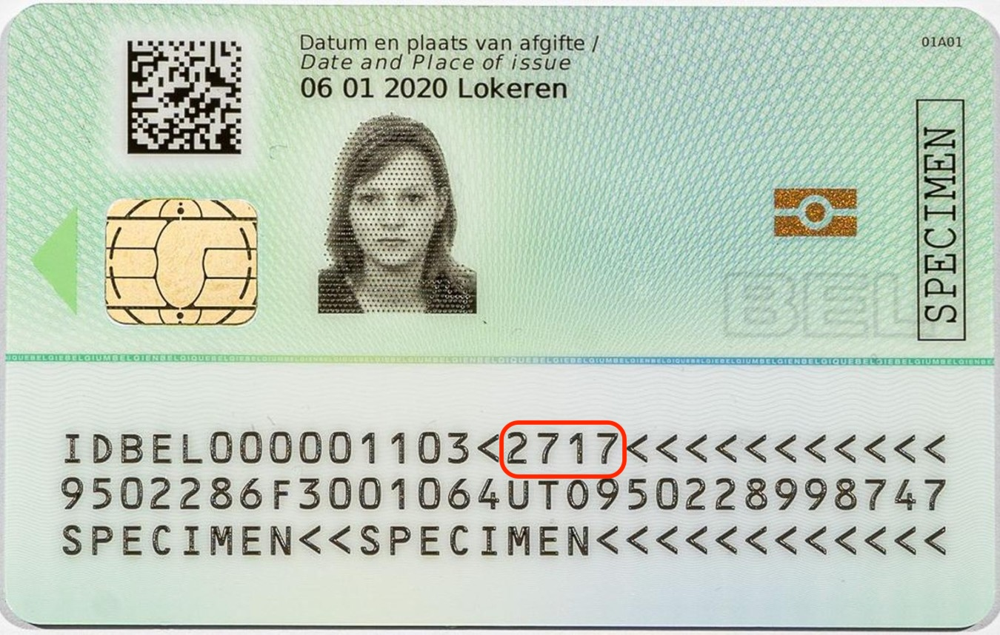

## This project in one line

Implementing ICAO 9303 TD1 overflow format validation to enable Self to scan ID cards with document numbers exceeding 9 characters for NFC authentication.

## Why Self

Self enables users to prove their identity in a privacy-preserving manner by generating zero-knowledge proofs from their passport or ID card data. To read the ID card data, Self scans the Machine Readable Zone (MRZ) at the bottom of the document. The MRZ contains essential information like document number, date of birth, and expiry date encoded in a standardized format defined by ICAO 9303. The MRZ embeds check digits (single-digit numbers calculated from the data using a formula) throughout the encoded fields to detect OCR scanning errors.

Accurately scanning the MRZ is critical for two reasons. First, the identity data parsed from the MRZ is required for proof generation. Second, the NFC chip on modern IDs protects its data behind access control. With Basic Access Control (BAC), the reader and chip derive session keys from the exact MRZ values (document number, date of birth, and expiry date) and then establish encrypted, authenticated communication. If any MRZ field, such as the document number, is incorrect, the derived keys will not match, mutual authentication will fail, and the chip's data cannot be read.

Travel documents use different MRZ formats depending on the document type. Passports typically use TD1 or TD3 formats, while ID cards use the TD1 format. The TD1 format consists of three lines of exactly 30 characters each. For document numbers exceeding 9 characters, ICAO 9303 Part 5 defines a special "overflow mechanism" where the first 9 digits are placed in the standard position (characters 6-14), position 15 contains a filler character '<' instead of a check digit to signal overflow, and the remaining digits overflow into the optional data field (starting at position 16) followed by the check digit that validates the full document number.

This case was discovered when testing Self with a Belgian ID card that failed to scan properly. The MRZ scanner would detect the text but validation consistently failed. Upon investigation on an iOS device, it was determined that the existing MRZ parsing library (QKMRZParser) does not correctly handle the TD1 overflow format defined in ICAO 9303 standard. This overflow format is used by ID cards worldwide when document numbers exceed 9 characters, affecting multiple countries including Belgium, Portugal, Spain, and others. Without proper overflow handling, these ID cards cannot be scanned in Self, and even if scanned, the truncated document number would cause NFC chip authentication to fail.

## Problems

The ICAO 9303 standard defines how document numbers exceeding 9 characters should be encoded in TD1 format. According to the specification:

> "If Document Number on a TD-1 has more than 9 characters. The nine (9) principal (most significant) characters shall be recorded in Data Element 04. Data Element 05 shall be coded with the filler character (<). The remaining characters of the document number shall be recorded at the beginning of Data Element 12 (Optional Data) followed by the Document Number Check digit and a filler character (<)."

The problem is that QKMRZParser uses hard-coded field indices that extract the document number from positions 6-14 only and validate it with the check digit at position 15. When it encounters '<' at position 15 instead of a digit, validation fails. The overflow digits at positions 16+ are completely ignored.

Three critical issues were identified in the current implementation:

1. **Hard-Coded Indices in Parser** - An [initial fix](https://github.com/selfxyz/self/pull/1061) attempted to manually extract overflow digits and concatenate them with the principal part. However, this fix was broken because QKMRZParser's validation runs first and rejects the MRZ before the custom logic executes.

2. **Only for Belgium** - The initial fix was [hard-coded to only work with Belgian IDs](https://github.com/selfxyz/self/blob/ee3a546469355cd12f30f48b103c157ff51d8f97/app/ios/LiveMRZScannerView.swift#L211) (`countryCode == "BEL"`), even though the TD1 overflow format is part of the ICAO 9303 international standard used by many countries.

3. **Stripping Characters** - The initial implementation was [stripping](https://github.com/selfxyz/self/blob/ee3a546469355cd12f30f48b103c157ff51d8f97/app/ios/LiveMRZScannerView.swift#L113) the first 3 characters from the document number without any ICAO specification basis, breaking NFC authentication.

## The solution

The solution bypasses QKMRZParser's validation entirely for TD1 overflow cases. Instead of relying on the parser, we:

1. Detect TD1 format by checking if line 1 has exactly 30 characters (more robust than checking document type which OCR can misread)
2. Manually extract and validate the document number using ICAO 9303 check digit algorithm
3. Store the validated full document number in an override variable
4. Use QKMRZParser only for extracting other fields (name, dates, nationality)
5. Ensure the correct full document number is used for NFC BAC key derivation

## What we shipped

**iOS implementation** — `app/ios/LiveMRZScannerView.swift`

- **ICAO 9303 Check Digit Calculator** - Implements the standard algorithm with 7-3-1 weight pattern, mapping digits 0-9, letters A-Z to 10-35, and filler '<' to 0
- **TD1 Overflow Format Handler** - Detects overflow when position 15 = '<', extracts principal part (positions 6-14) and overflow digits (positions 16+), constructs full document number and validates check digit manually
- **TD1 Document Processor** - Uses manual validation for document number instead of relying on QKMRZParser in case of an overflow, bypasses parser's broken validation, stores validated full document number in `overrideDocumentNumber` state variable
- **Document Number Mapping** - Uses `overrideDocumentNumber` if available (for TD1 overflow cases), falls back to parser's document number for standard cases

## What's next

1. **Test NFC authentication on iOS** - Validate that the full untruncated document number works correctly for NFC chip authentication (BAC key derivation). Justin is creating a TestFlight build for physical device testing.

2. **Check if same issue exists on Android** - Test Android MRZ scanning with ID cards that use TD1 overflow format to verify if the same limitation exists.

3. **Implement Android solution if needed** - If Android has the same issue, implement the TD1 overflow validation following the same approach as iOS (manual check digit validation bypassing the parser's hard-coded indices).

4. **Consider updating the parser library** - Investigate whether QKMRZParser (iOS) and jmrtd (Android) can be updated or forked to natively support TD1 overflow format, which would be a more sustainable long-term solution than the current workaround.

## Get involved

Feel free to implement one of the above "What's next" items. You can contact me via @armankolozyan (https://armankolozyan.com) in case of any questions.

## References

- [ICAO Doc 9303 Part 5 - Machine Readable Travel Documents (TD1)](https://www.icao.int/sites/default/files/publications/DocSeries/9303_p5_cons_en.pdf)
- [LDS Technical Report 2004 - Document Number Overflow Format (14.1.1)](https://is.muni.cz/el/1433/podzim2007/PV181/um/ep/LDS-technical_report_2004.pdf)
