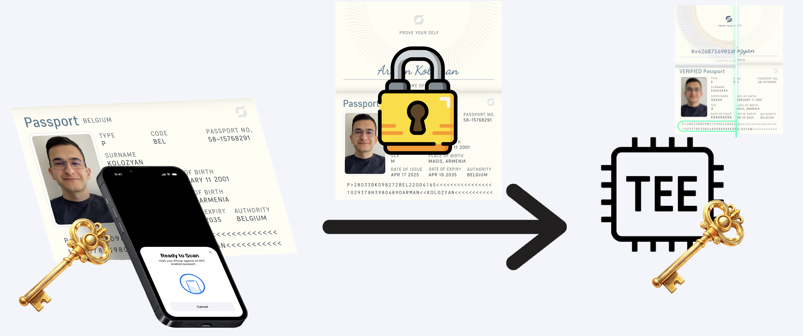
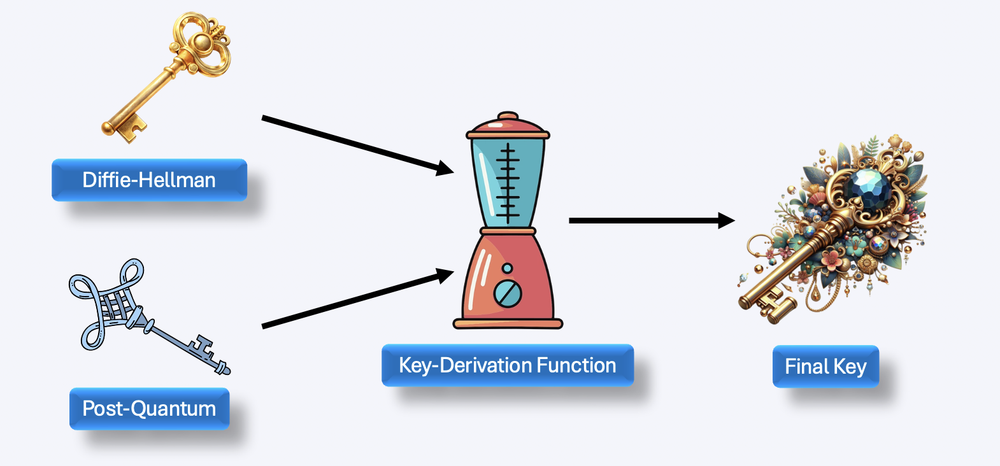

## This project in one line

Implementing Signal's PQXDH protocol to future-proof Self's passport verification
against quantum attacks using hybrid classical and post-quantum cryptography.

## Why Self

Self enables users to prove their identity in a privacy-preserving manner by generating zero-knowledge proofs from their passport data. These proofs allow verification of identity attributes without revealing the underlying sensitive information.

Ideally, proof generation would happen entirely client-side on the user's mobile device. However, this approach faces practical challenges. Zero-knowledge proof systems require large cryptographic artifacts: proving keys for passport verification circuits can exceed GBs. Downloading these artifacts to mobile devices is impractical. Furthermore, proof generation itself is computationally intensive, requiring significant CPU and memory resources that would drain mobile battery life and cause poor performance on lower-end devices.

To address these constraints, Self uses a Trusted Execution Environment (TEE) to perform proof generation. The mobile app sends encrypted passport data to the TEE, which generates the zero-knowledge proof in a secure, isolated environment. The TEE provides strong isolation designed to keep passport data confidential even from the cloud provider, while its computational resources enable fast proof generation without impacting the mobile user experience.

This mobile ↔ TEE communication channel requires strong cryptographic protection. The original implementation used P-256 ECDH (Elliptic Curve Diffie-Hellman) to establish a shared secret during the handshake, which was then used to encrypt the passport data transmission. While P-256 ECDH is secure against current computers, it is vulnerable to quantum computers through [Shor's algorithm](https://en.wikipedia.org/wiki/Shor%27s_algorithm).

This creates a ["harvest now, decrypt later"](https://en.wikipedia.org/wiki/Harvest_now,_decrypt_later) threat: adversaries can record encrypted traffic today during the mobile ↔ TEE handshake and store it for later. When large-scale quantum computers become available, these adversaries can decrypt the captured data using Shor's algorithm to break the ECDH key exchange. The result is that user passport information and biometric data are compromised retroactively, potentially years or decades after the original communication.

## How it works

Post-quantum cryptography addresses quantum threats by using mathematical problems that remain computationally hard even for quantum computers. Classical algorithms like P-256 ECDH rely on the elliptic curve discrete logarithm problem, which Shor's algorithm can solve efficiently on quantum computers. In contrast, lattice-based cryptography uses problems like Module Learning With Errors (MLWE). NIST recently standardized [ML-KEM](https://csrc.nist.gov/pubs/fips/203/final) (formerly known as Kyber), providing a thoroughly-reviewed post-quantum key encapsulation mechanism based on MLWE.

ML-KEM is a Key Encapsulation Mechanism (KEM), which works differently from traditional Diffie-Hellman key exchange. In a KEM, one party generates a keypair and publishes their public key. The other party uses this public key to perform encapsulation: they generate a random shared secret and encrypt it with the public key to produce a ciphertext. The first party then performs decapsulation: they use their private key to decrypt the ciphertext and recover the same shared secret. This asymmetric approach works well with lattice-based cryptography, where the mathematical structure naturally supports encryption operations rather than interactive key agreement.

However, post-quantum cryptography is relatively new compared to classical algorithms like ECDH, which have decades of cryptanalysis behind them. Pure post-quantum solutions carry the risk that future mathematical breakthroughs could unexpectedly weaken lattice-based assumptions. To address this, cryptographers developed hybrid constructions that combine classical and post-quantum algorithms. A hybrid protocol remains secure as long as *at least one* of its component algorithms is unbroken, providing defense-in-depth against both quantum computers and potential advances in cryptanalysis.

[PQXDH (Post-Quantum Extended Diffie-Hellman)](https://signal.org/docs/specifications/pqxdh/) is a hybrid key exchange protocol originally developed by Signal for their messaging application. The PQXDH specification combines X25519 (a widely-trusted elliptic curve Diffie-Hellman algorithm) with ML-KEM-768 (a lattice-based key encapsulation mechanism). During a PQXDH handshake, both parties perform X25519 key agreement and ML-KEM encapsulation/decapsulation, then combine the two resulting shared secrets using HKDF (a key derivation function) to produce the final session key. This ensures that breaking the session key requires breaking *both* X25519 and ML-KEM-768 simultaneously.

We implemented PQXDH (Post-Quantum Extended Diffie-Hellman). The implementation follows Signal's PQXDH specification, which has undergone extensive security review by the cryptographic community. To maintain backward compatibility with existing clients, we implemented suite negotiation. Clients advertise support for both Self-PQXDH-1 (the hybrid protocol) and legacy-p256 (the original P-256 ECDH). The TEE server selects the strongest mutually-supported suite, preferring PQXDH when available.

The implementation uses well-vetted cryptographic libraries on both sides. The TypeScript client relies on [@noble/post-quantum](https://github.com/paulmillr/noble-post-quantum), a zero-dependency implementation of ML-KEM. The Rust server uses the [RustCrypto ml-kem](https://github.com/RustCrypto/KEMs/tree/master/ml-kem) crate, which implements the NIST-standardized ML-KEM-768 algorithm. Both libraries follow NIST FIPS 203 (the ML-KEM standard), ensuring cross-language interoperability.

The PQXDH handshake occurs in three phases. First, the client opens a WebSocket connection and sends a hello message advertising supported cipher suites along with its X25519 public key. Second, the TEE server selects the strongest mutually-supported suite and responds with its own X25519 and Kyber public keys embedded in an attestation document. The client then performs both X25519 key agreement and Kyber encapsulation, combines the resulting shared secrets using HKDF, and sends the Kyber ciphertext back to the server in a key_exchange message. Third, the server decapsulates the Kyber ciphertext, performs the same HKDF derivation, and confirms completion. Both sides now share an identical session key derived from both classical and post-quantum shared secrets.

## What we shipped

**Mobile side (TypeScript)** — [PR #1316](https://github.com/selfxyz/self/pull/1316)
- PQXDH cryptographic primitives (X25519 key generation, Kyber encapsulation, HKDF session key derivation)
- Suite negotiation in proving state machine
- Hybrid key exchange flow with Kyber ciphertext transmission
- Legacy P-256 fallback for backward compatibility

**TEE server side (Rust)** — [PR #27](https://github.com/selfxyz/tee-prover-server/pull/27)
- Suite negotiation (prefers PQXDH, fallbacks to legacy P-256)
- X25519 + Kyber keypair generation and key exchange handling
- Multi-state session management (LegacyP256, PqxdhPending, PqxdhComplete)
- Kyber decapsulation and HKDF key derivation
- Standalone test server with mock attestation for local development

## What's next

The implementation is complete and all tests pass, but several audits are required before production deployment. A third-party security audit by zkSecurity is pending to review the PQXDH protocol implementation across both mobile and TEE components. Additionally, both cryptographic libraries used in this implementation, [@noble/post-quantum](https://github.com/paulmillr/noble-post-quantum) and [RustCrypto ML-KEM](https://github.com/RustCrypto/KEMs/tree/master/ml-kem), have not yet undergone formal security audits. Independent audits of these libraries are necessary to provide strong assurance of their correctness and security before deploying PQXDH to production.

## References

- [Signal PQXDH Specification](https://signal.org/docs/specifications/pqxdh/)
- [NIST FIPS 203: ML-KEM Standard](https://csrc.nist.gov/pubs/fips/203/final)
- [Harvest Now, Decrypt Later](https://en.wikipedia.org/wiki/Harvest_now,_decrypt_later)

## Get involved

- Mobile repo: https://github.com/selfxyz/self/pull/1316
- TEE server repo: https://github.com/selfxyz/tee-prover-server/pull/27
- Contact: @armankolozyan (https://armankolozyan.com)
